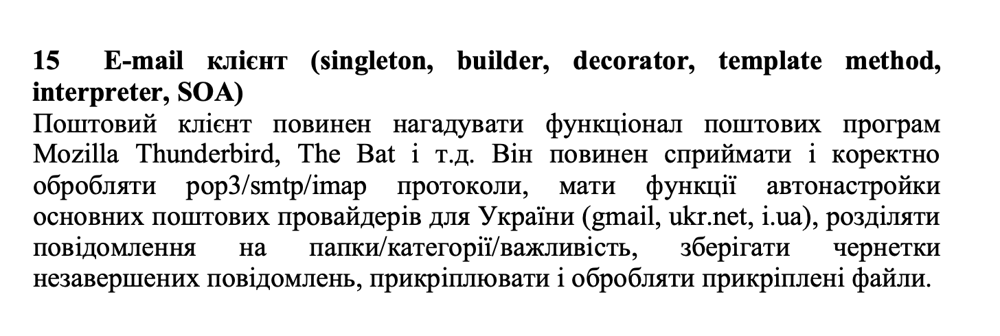

## An email client.

This is a web application.

Technologies used:
- Backend: Flask, sqlite3.
- Frontend: Bootstrap5, jQuery.

Task:

---

Created as a course project for KPI University:

Bachelor's 3rd year, 1st semester, class ТРПЗ - "Технології розроблення програмного забезпечення".

Tools used:
- feathericons (for the icons)
- DALLE-2 for logo generation
- favicon.io

